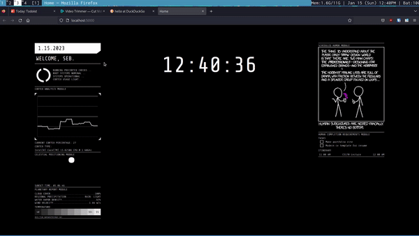

# Over-Engineered Startpage


A startpage is a web page meant to replace the "Home" and/or "New Tab" page of your web browser. For many people, this is simply google.com. However, there is a [sizeable online community][reddit] dedicated to building custom startpages. A custom startpage is not only built for aesthetics, as users often add functionality by providing links to their most visited websites, local weather data, Spotify music players, etc. 

My initial goal with my own startpage was to create a non-functional version of this [concept image](https://www.reddit.com/r/startpages/comments/bxabnv/concept_cyberpunk_scifi_startpage/). I really wished it was more than just a concept but was intimidated by the idea of implementing the functionality. As I began working on it, I couldn't help but think about how much cooler the project would be if it were functional and began implmenting a few of the features (detailed in the next section). I soon gained momentum and began adding more features. I even began to deviate a bit from the concept, as I wanted a feature it didn't have or a thought a feature would be better if the startpage design were different. I honestly think I got a bit carried away (a node.js server feels like overkill for this sort of thing), but it was fun and I'm happy with the result.

## Features


The webpage integrates tilde functionality from the [tilde enhanced project](https://github.com/ozencb/tilde-enhanced). This provides a quick way to search for things or launch your favorite websites. Typing anything while the startpage is open will bring up this menu and deleting everything or pressing "Escape" will close it. You can search the typed text on a search engine by pressing "Enter". The default search engine is DuckDuckGo, but this can be changed in the public/script/tilde.js file. You can also add tags to search specific websites. The image above would search YouTube for "Ludwig" once the user presses "Enter". More information on tilde functionality can be found on the [tilde enhanced github](https://github.com/ozencb/tilde-enhanced) itself.


I don't even have a name for this part of the webpage, but it gets the current date and the username you have on your operating system and displays them. The "Running Precortex Checks..." and other text messages are purely aesthetic and aren't connected to an active feature in anyway. The exception is "Cortex Usage" which will display "USAGE HIGH" if your CPU usage is greater than 75%, "USAGE NORMAL" if CPU usage is greater than 50%, and "USAGE LOW" otherwise. 


The Cortex Analysis Modules graphs your CPU usage with the [Google Charts API](https://developers.google.com/chart/). It also displays the current usage, as well as the make and model of your CPU.


The Celestial Position Module shows you how much day or night you have left with a little image of the sun/moon that move in a parabolic arc as time progresses. It will also display the estimated sunset/sunrise time for your current location.


The Planetary Report Module displays weather data from the [OpenWeatherMaps API](https://openweathermap.org/). Most of these are relatively straightforward. Rain and snow are considered light, heavy, or moderate depending on the highest mm/hr forecasted for the current day. The exact amount of mm/hr that are consider "light" or "heavy" is based on numbers I found online: I'm not sure how accurate they are. 


The temperature portion displays the high and low temperatures of the day on the rightmost and leftmost square respectively. These aren't super accurate: OpenWeather doesn't provide a high and low temperature forecast in the free version so I calculate them by looking at all the forecasted temperatures for the day. They still end up a little off compared to the official high/low forecast. The current temperature can be displayed on any square. It'll be displayed on a square that's on the right side if the current temperature is close to the highest temperature of the day, and vice versa for low temperatures. The current temperature can replace the high and low for the day, but you can distinguish the current temperature because it will always be displayed with a colon ":" at the end.


The Scheduled Humor Module is pretty simple: it'll pull a random xkcd comic whenever you open the startpage. It does this by going to https://c.xkcd.com/random/comic and following the redirect. It then webscrapes that redirected webpage with [cheerio](https://cheerio.js.org/). Since xkcd comics vary a lot in their size ratios, they're sometimes not readable from the webpage itself, but you can click on the comic and it'll open it in a new page.


The Human Completion Requirements Module is divided into two sections: the tasks and iternary section.


The tasks section is a small todolist. It's integrated with [Todoist](https://todoist.com/), a commonly used todolist app. It displays the active tasks from that app, with higher priority tasks showing up first. There's no way to add tasks from the webpage just yet, but you can remove tasks and they should update on your Todoist account.


The itinerary section integrates with [Google Calendar](https://calendar.google.com) to get your schedule for the day. The start time and end time of each event are displyed on the left and right hand side respectively, while the event name is in the center.


## Installation
You'll first need to download the startpage itself. If you're familiar with Git you can git clone, but if you aren't you can click the big green "Code" button at the top of this page and then click "Download Zip".

You'll then need to install [Node.js](https://nodejs.org/). You might need to install node packages with npm as well, more on that later. 


You'll also need authentication keys for the services that this page uses: [Openweathermaps](https://home.openweathermap.org/api_keys) and [Todoist](https://todoist.com/app/settings/integrations/developer). You'll need to copy and paste them at the top of the index.js file. Google Calendar integration is a little more involved. You'll need to create a service account and share your calendar with that service account. You'll also need to get a credentials.json file for that service account and paste the path to it into the index.js file. This [video](https://www.youtube.com/watch?v=PFJNJQCU_lo) demonstrates how to do so. You'll also need to paste your calendar id in the index.js file of the specific calendar you want to use. If you are using your primary calendar, this should just be your gmail. Otherwise, you can find your calendar id at the bottom of your calendar settings.

Once this is all done you should be able to run this command from the Startpage directory:
```
node index.js
```
And you should see the webpage when you go to "localhost:5000" in your browser. If you get an error while trying to run the file later that sounds something "undefined reference to {package_name}", that's the node packages I mentioned before. You can just run:
```
npm install package_name
```
You might want to look into running the script above automatically. I use my xinitrc on my Linux system, but I'm not sure how one would do this on other operating systems.


[//]: # (These are reference links used in the body of this note and get stripped out when the markdown processor does its job. There is no need to format nicely because it shouldn't be seen. Thanks SO - http://stackoverflow.com/questions/4823468/store-comments-in-markdown-syntax)
   [reddit]: <https://reddit.com/r/startpages>
